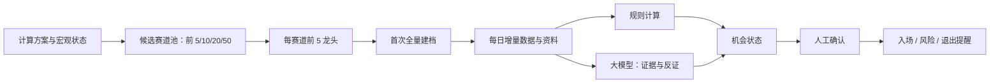

# 价值线持续研究与进出场监控重构方案

> 状态：待实施
>
> 范围：A 股价值投资线（不影响情绪线、回测、模拟盘与任何实盘能力）
> 数据口径：首版以通达信板块及成分股为主；所有自动结论均可回溯到数据日期、来源和规则/模型版本。

## 1. 目标

价值线不应只是一次性的“宏观—赛道—龙头”筛选页，而应成为持续运行的研究工作台：先把候选龙头池完整建档，之后每天补充市场、财务和公开资料，基于可复现规则与大模型的定性分析识别机会和风险，最终向用户推送**入场、减仓/退出、复核**提醒。



系统只产生研究结果、待办和通知，**不接入实盘下单，也不自动交易**。

## 2. 核心业务对象与边界

| 对象 | 定义 | 约束 |
| --- | --- | --- |
| 候选赛道池 | 当前计算方案下排名靠前的通达信赛道 | 用户选择前 5、10、20 或 50；不是全市场所有赛道 |
| 龙头池 | 每个候选赛道按当前规则选出的前 5 家公司 | 必须属于该通达信板块成分股；同一股票可因跨板块出现，但需保留归属 |
| 研究宇宙 | 某次运行固定下来的“赛道—龙头—公司”快照 | 例如前 20 个赛道 × 每赛道前 5 家，理论上最多 100 条归属；公司去重后形成研究主体 |
| 公司档案 | 公司首次全量资料、结构化事实、财务分析、估值、风险与投资逻辑 | 资料必须带来源、发布日期、抓取时间和适用截至日 |
| 增量事件 | 收盘行情、公告、财报、股东/治理、行业或宏观变化 | 以内容哈希和来源主键去重，不重复分析同一资料 |
| 信号 | 规则或模型产生的入场、风险、退出、复核建议 | 不等于交易指令；没有足够数据时必须为“不可判断” |

## 3. 目标工作流

### 3.1 首次建池与全量建档

1. 用户选择并运行计算方案（单模型或组合模型）。
2. 系统将结果冻结为运行快照，按用户选择的前 5/10/20/50 个赛道建立候选赛道池。
3. 每个赛道只取前 5 位龙头，形成研究宇宙；公司去重，但保留其全部赛道归属和龙头类型。
4. 系统按受控并发分批执行首次建档：公司基本事实、历史财务、估值基础数据、公告/新闻索引、风险清单和同业可比。
5. 数据齐备后生成结构化研究底稿；缺数据的字段必须明确标为“不可运行/待补充”，禁止用猜测值填充。
6. 需要大模型解读的资料创建“待分析”任务；模型输出只包含有来源的事实摘要、支持证据、反证、待核实项和结论置信度。
7. 首次建档完成后，用户确认哪些公司进入长期跟踪池；未确认公司仅保留档案，不发送交易机会提醒。

### 3.2 每日增量循环

在每个交易日收盘且收盘数据完成更新后运行（目标时间为 Asia/Shanghai 16:45；若数据未到齐则延迟重试，并记录数据过期）。

1. 更新研究宇宙中的日线、估值快照、财务披露和公开资料索引。
2. 根据来源主键、发布日期和内容哈希识别新增或修订的资料。
3. 对新增数据运行确定性规则：价格区间、安全边际、估值分位、财务变化、数据新鲜度和投资逻辑失效条件。
4. 有新增可读资料时触发大模型增量分析：与上一期结论比较，输出“新增支持/新增反证/需要人工复核/结论变化”。
5. 合并规则结果与模型证据，生成公司当日机会状态及事件。
6. 触发条件满足后写入站内事件；对已启用的飞书、微信分别投递，并记录每个渠道的结果。
7. 推送失败不影响信号计算；下一轮可按渠道重试，且不得重复创建同一业务事件。

### 3.3 人工决策边界

- 人工确认后，公司才能从研究宇宙进入“监控池”。
- 投委会只对用户选定的重点公司人工发起；模型不能替代投委会批准。
- 入场/减仓/退出均是提醒和复核任务，需由用户或授权投委会执行实际决策。
- 模型无法读取、来源冲突、财报未披露或关键估值输入不足时，状态应为“数据不足”，不应给出方向性建议。

## 4. 规则与大模型的职责划分

### 4.1 规则引擎（确定性、可复现）

规则引擎负责计算，不依赖模型文本：

- 入场：目标价格区间、安全边际、PE/PB/现金流估值分位、估值模型可用性、数据时效。
- 风险：财务指标恶化、估值明显透支、重大公告、长期未更新、关键资料冲突。
- 退出/减仓：达到价值目标区间、基本面或投资逻辑失效、治理/风险条件触发、估值和收益风险不再匹配。
- 状态：`watching`、`entry_candidate`、`holding_review`、`exit_candidate`、`thesis_invalidated`、`data_insufficient`、`stale`。

每条规则结果都需保存：规则版本、输入值、数据截至日、计算时间、是否触发及触发原因。

### 4.2 大模型研究层（解释、反证、增量比较）

大模型不生成确定性基础分，也不直接决定买卖。其固定输出结构为：

- 新资料摘要及来源引用；
- 对既有投资逻辑的支持证据和反证；
- 财务、竞争壁垒、治理、行业景气和风险变化；
- 与上一份研究结论的差异；
- 需人工验证的问题；
- `support / neutral / caution / invalidate` 的定性判断与置信度。

模型输出必须绑定输入资料集合与模型/提示词版本。没有接入可用模型提供方时，任务保持 `pending` 或 `unavailable`，绝不伪造研究结论。

## 5. 数据架构

### 5.1 数据来源与优先级

第一阶段优先使用已有通达信能力，后续按可用性逐步补充：

| 类别 | 首选 | 回退/后续 | 用途 |
| --- | --- | --- | --- |
| 赛道与成分股 | 通达信板块、成分股 | 无名称猜测映射 | 固定赛道口径与龙头候选范围 |
| 行情与估值快照 | 通达信 | Tushare / AKShare | 价格、成交、PE/PB、估值分位输入 |
| 财务与披露日期 | Tushare | AKShare、上市公司公开披露索引 | PIT 财务分析、财务变化与估值输入 |
| 公告与公开资料 | 已配置的可合法访问来源 | 交易所/公司官网的合规接口或索引 | 增量证据和风险识别 |
| 宏观状态 | Tushare | AKShare | 只作赛道上下文，来源失败时失败关闭 |

所有接入都必须记录 `source`、`source_id/url`、`published_at`、`fetched_at`、`data_as_of`、`content_hash` 和原始载荷定位；不得把示例数据混入正式运行。

### 5.2 建议新增/扩展的数据表

| 表/实体 | 关键字段 | 作用 |
| --- | --- | --- |
| `value_research_universes` | `run_id`、候选赛道范围、规则版本、状态 | 冻结某次龙头研究宇宙 |
| `value_research_universe_members` | `universe_id`、`symbol`、`track_id`、`leader_type`、入选/移出原因 | 保留公司与赛道的多对多归属 |
| `company_research_snapshots` | `symbol`、版本、`data_as_of`、档案状态、完整度 | 首次全量和后续定期研究版本 |
| `company_research_evidence` | 资料来源、哈希、日期、结构化类型、处理状态 | 可去重的原始及结构化证据索引 |
| `company_incremental_jobs` | 公司、资料范围、状态、重试、幂等键 | 每日增量获取与分析任务 |
| `company_ai_analyses` | 输入证据集、模型/提示词版本、支持/反证、置信度 | 可审计的模型解读结果 |
| `value_signal_evaluations` | 规则版本、输入快照、结果状态、原因 | 每次规则计算的完整审计记录 |
| `value_monitor_events` | 事件类型、严重度、去重键、确认状态 | 站内待办与提醒事件 |
| `notification_deliveries` | 事件、渠道、投递状态、错误、重试数 | 飞书/微信/站内独立投递追踪 |

现有的 `value_tracks`、`value_track_leaders`、研究批次/任务、监控配置/事件/投递表应保留并迁移兼容，不删除历史评分或报告。

### 5.3 幂等与数据新鲜度

- 研究宇宙幂等键：`run_id + candidate_limit + leader_rule_version`。
- 首次建档幂等键：`universe_id + symbol + research_template_version`。
- 增量任务幂等键：`symbol + source + source_id + content_hash`。
- 信号事件幂等键：`monitor_id + signal_type + trading_date + rule_version + relevant_snapshot_hash`。
- 外部通知幂等键：`event_id + channel`。
- 数据超过各类来源规定的最大时效，信号必须标记 `stale` 或 `data_insufficient`，不能以旧数据确认入场或退出。

## 6. 后端服务重构

### 6.1 服务分层

```text
ValueResearchUniverseService
  └─ 从价值引擎运行快照建立/更新研究宇宙

CompanyResearchService
  ├─ 首次全量建档（限流、分批、可恢复）
  ├─ 资料归档与 PIT 财务/估值计算
  └─ 生成结构化研究快照

IncrementalResearchService
  ├─ 收盘后采集增量数据和公开资料
  ├─ 去重、资料分类、触发模型任务
  └─ 更新公司研究快照

ValueSignalService
  ├─ 入场/风险/退出规则计算
  ├─ 合并人工确认和模型证据状态
  └─ 产生可追溯监控事件

NotificationService
  └─ 站内、飞书、微信独立投递与重试
```

### 6.2 任务状态

研究批次、公司建档和增量任务统一采用：`queued / running / partial / completed / failed / cancelled`。

- 首次建档按每批最多 20 家、默认并发 3 家执行，支持失败单项重试。
- 增量任务按公司和来源切分，避免某一来源失败阻塞其他来源。
- DCF 输入不足时 DCF 为 `unavailable`，可比估值仍可独立完成。
- 任意任务取消后，未开始任务停止；已完成资料保留，状态可恢复。

### 6.3 调度

- 交易日 `16:45 Asia/Shanghai` 启动收盘后增量流程；先校验交易日和行情/财务数据水位。
- 数据未就绪时采用有限次数的延迟重试；超过窗口写入“数据过期”事件。
- 调度器须有分布式/数据库执行锁，避免服务重启或多实例重复运行。
- 允许手动触发一次“补历史档案”与“一日增量重跑”，均使用同一幂等规则。

## 7. API 调整

保留现有价值工作台接口，并新增或扩展以下能力：

| 接口 | 说明 |
| --- | --- |
| `POST /strategy/value/research-universes` | 从指定运行和候选赛道范围创建研究宇宙 |
| `GET /strategy/value/research-universes/{id}` | 查看赛道、公司归属、建档与跟踪状态 |
| `POST /strategy/value/research-universes/{id}/bootstrap` | 启动全量建档，支持受控并发 |
| `GET /strategy/value/companies/{symbol}/archive` | 获取公司研究档案、来源链、资料新鲜度与历史结论 |
| `POST /strategy/value/incremental-runs` | 手动触发可幂等的日增量任务 |
| `GET /strategy/value/incremental-runs/{id}` | 查看各来源、公司、模型分析任务进度 |
| `GET /strategy/value/signals` | 按入场/风险/退出、公司、日期和确认状态筛选 |
| `POST/PATCH /strategy/value/monitors` | 配置入场、退出、逻辑失效及通知渠道条件 |
| `POST /strategy/value/monitor-events/{id}/acknowledge` | 人工确认或关闭事件；不执行交易 |

原有批量研究、监控和报告接口继续可用，内部逐步映射到新的研究宇宙和增量任务。

## 8. 前端信息架构

### 8.1 价值研究总览

保持主从式布局，避免宏观、赛道、龙头拆成互相断开的页面：

```text
顶部：计算方案 | 宏观状态 | 数据日期 | 公式版本 | 重新计算
左侧：候选赛道排名（前 5 / 10 / 20 / 50）
右侧：所选赛道前 5 龙头、档案完整度、跟踪状态、批量建档
底部：首次建档队列 | 当日增量 | 入场/风险/退出事件 | 渠道投递状态
```

切换赛道只能刷新右侧龙头区域，必须保留当前计算方案、运行快照和候选范围。提供“全部候选龙头”视图，按公司去重展示，并可回看每个公司所属赛道。

### 8.2 公司研究档案

一个公司档案至少包含：

1. 来源链：计算方案 → 宏观状态 → 通达信赛道 → 龙头类型 → 公司。
2. 资料完整度和各来源最新日期。
3. 事实底稿、PIT 财务、护城河/竞争格局、治理与风险、DCF/可比估值。
4. 最新增量资料、模型支持/反证、与上期结论的差异。
5. 投资逻辑、失效条件、入场条件和退出条件。
6. 信号时间线、人工确认记录及各通知渠道投递结果。

### 8.3 监控中心

监控中心按事件而非仅按公司展示，明确区分：

- **入场候选**：达到价格/安全边际/估值等条件，等待人工复核；
- **风险复核**：出现财务、估值、资料或反证问题；
- **退出/减仓候选**：价值兑现、估值过高或逻辑失效；
- **数据问题**：关键来源过期、缺失或相互冲突。

每条事件展示触发规则、输入数据日期、证据链接、模型结论、人工状态和投递状态。

## 9. 分阶段实施

### 阶段 A：研究宇宙与首次建档（最小可用）

- 从前 5/10/20/50 候选赛道 × 每赛道前 5 龙头生成冻结研究宇宙。
- 公司去重、保留多赛道归属；提供全部候选龙头池视图。
- 使用现有研究批次能力，增加“全量建档”入口、进度、幂等和失败重试。
- 公司档案显示真实资料来源、数据日期、完整度和不可运行原因。

验收：选择前 20 个赛道后可一键建立最多 100 条赛道归属的研究宇宙，所有公司均有可追溯的建档任务状态。

### 阶段 B：日增量资料与研究快照

- 建立资料哈希去重、来源新鲜度和增量任务表。
- 收盘后更新行情/估值/财务与可用公开资料索引。
- 把新资料合并为新研究快照，保留版本差异。
- 没有模型提供方时明确显示“待模型分析”，不输出模拟结论。

验收：同一资料不会重复入库；一天内重复执行不会产生重复研究或事件；可查看某家公司当天新增了什么。

### 阶段 C：规则信号与通知

- 将监控条件扩展为入场、风险、退出、逻辑失效与数据过期。
- 实现交易日收盘后定时、执行锁、延迟重试、事件去重和渠道独立投递。
- 前端事件中心和公司档案时间线联动。

验收：使用测试行情/财务变化可分别触发入场、风险和退出事件；站内、飞书、微信各自有可追溯投递记录，任一渠道失败不影响其他渠道。

### 阶段 D：大模型增量分析与人工投委会

- 接入已配置的大模型提供方，使用结构化输出与证据引用。
- 增加新旧结论差异、反证、置信度和人工复核队列。
- 仅对用户选定重点公司开放人工投委会。

验收：模型不能在无资料输入时产出结论；每项结论可回溯输入资料和版本；人工确认不触发任何下单。

## 10. 测试与验收清单

- 龙头候选严格限制在当前通达信赛道成分股，且每赛道最多 5 家。
- 候选赛道范围为前 5/10/20/50，全部候选龙头视图可正确去重并保留归属。
- 研究宇宙、首次建档、增量资料、规则事件和通知投递均具备幂等性。
- PIT 财务数据不会使用报告期之后才公开的数据；DCF 缺输入时失败关闭。
- 价格、估值、财务恶化、逻辑失效和数据过期可独立触发对应事件。
- 交易日 `16:45 Asia/Shanghai` 调度、重复触发抑制和数据未就绪重试可测试。
- 飞书、微信投递失败互不影响，错误和重试状态可见。
- 前端覆盖空数据、部分失败、窄屏、旧路由跳转和手动确认状态转换。
- 回归验证情绪线、因子实验室、回测、模拟盘和实盘安全边界均不受影响。

## 11. 明确不做的事

- 不把全部 A 股都当作“龙头”；仅研究当前候选赛道中的每赛道前 5 龙头。
- 不用大模型替代财务、估值或排名的基础计算。
- 不在数据不足、来源过期或关键逻辑无法验证时给出确定性买卖建议。
- 不自动下单、不恢复任何实盘连接。
- 第一版不引入申万映射、自建产业树或港股页面；保留未来兼容字段即可。

## 12. 当前系统差距

当前版本已有价值工作台、候选赛道范围、每赛道前 5 龙头、人工启动的批量研究、基础研究档案和简单价格/PE 监控；但仍缺少：

1. 由候选龙头池自动生成并长期保存的研究宇宙；
2. 面向整池的首次全量建档调度；
3. 每日资料增量、去重、版本比较与来源新鲜度管理；
4. 完整的入场、风险、退出和逻辑失效规则；
5. 实际启用的 16:45 交易日调度与执行锁；
6. 具备证据引用和反证输出的大模型研究层；
7. 以事件为中心、可人工确认和可追踪投递的监控中心。

后续开发应按阶段 A → B → C → D 推进，先确保数据、规则与审计链可靠，再接入模型解释能力。
